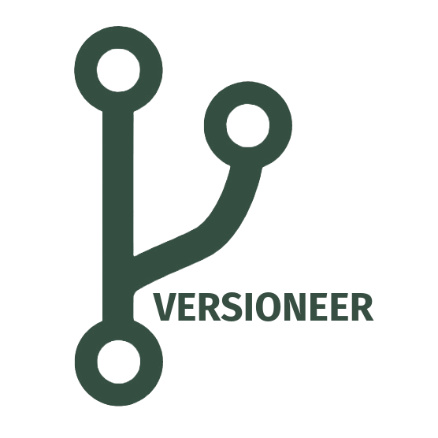

 

# packageR 

## Goal

**packageR** is a tool maintained by the [Versioneer team](https://versioneer.at) to provide seamless browsing through items within s3 buckets for authorized users. It enables users to share specific items with anonymous users via a regular HTTP link for a specific duration, optionally protected by a password. This link allows recipients to navigate through the shared items and generate [presigned URLs](https://docs.aws.amazon.com/AmazonS3/latest/userguide/using-presigned-url.html) for direct download of one or more items, using e.g. CLI tools like [wget](https://www.gnu.org/software/wget/) facilitating resumption of broken downloads even for large files.

## Roadmap

- Provide capabilities to browse through multiple buckets via configurable Sources.
  - [x] Leverage Kubernetes for management of Sources.
  - [x] Support statically configured Sources
  - [ ] Allow to dynamically connect additional Sources.
- [x] Allow to include additional metadata to Links.
- Introduce the concept of FileSets representing a logical grouping of files (a "package") within a Source
  - [x] Proper visualization in Menu to differente Sources from FileSets
  - [ ] Allow to dynamically create FileSets from Sources via Index
- [ ] Expose and show item checksums.
- [ ] Extend sharing capabilities beyond dynamic prefix paths filtering.
- [ ] Support sharing of even millions of items (note: currently presigned URLs generation is limited to a maximum of 5000 items).
- [ ] Make presigned URLs expiration configurable (currently links are always valid for 7 days after generation).

## Setup

- Pre-configured docker images are published to [`ghcr.io/versioneer-tech/package-r`](https://github.com/versioneer-tech/package-r/pkgs/container/package-r)

**With Environment Variables:**

- As the AWS S3 SDK is used for bucket access, common configuration e.g. through environment variables `AWS_ACCESS_KEY_ID`, `AWS_SECRET_ACCESS_KEY`, and `AWS_REGION` applies.
- Bucket(s) to be used as Sources are configured via the `BUCKET_DEFAULT` environment variable (separated by |).
- The name of the instance can be configured via the `BRANDING_NAME` environment variable.
- A login password can be configured via the `PASSWORD` environment variable, otherwise the `AWS_SECRET_ACCESS_KEY` must be provided for login. 

**Kubernetes based:**

- Coming soon!

## Inheritage

**packageR** is built on a fork of [File Browser](https://github.com/filebrowser/filebrowser/). While essential bug fixes relevant to the  File Browser project may be submitted to the original project, new features and capabilities are not planned to be contributed back due to the different scope of this fork.

The following capabilities have been removed from the forked codebase:
- Disk usage information
- Checksum calculation
- Content type inference through probes
- Image size resolution and automated image resizing
- Video subtitle support
- QR code generation
- Raw (proxying) download
- Image resizing
- Server file caching

The following capabilities have been suspended within the forked codebase:
- No editing support; all items are currently treated as read-only.
- No shell command execution on trigger events; sandboxed execution may be reintroduced.
- No custom styling;