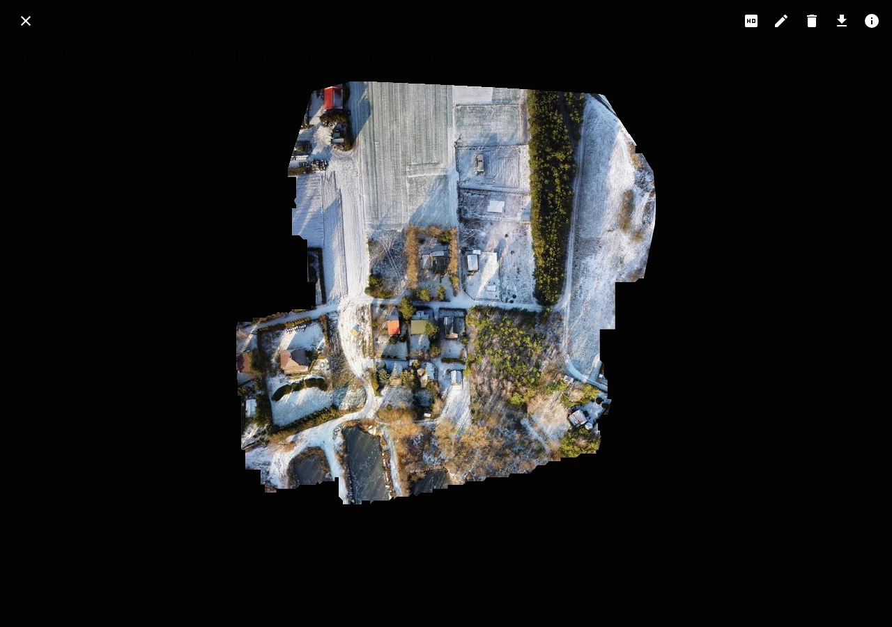

# Package, share, and preview data

packageR publishes an object prefix as a browser package. Recipients do not
need an account. Operators define packages before startup. Users can open the
links in the web interface, but cannot change them.

## Package an object prefix

Use the share command to map a public name to an object path. When
`PACKAGE_R_ROOT` selects one bucket, the path is a prefix in that bucket:

```bash
./package-r shares add admin public /deliverables/26-06
./package-r shares add admin f4ae91c8d2 /reports/report.tif
```

A prefix package lets a public visitor navigate below the configured path. A
single-object package opens that object. The visitor cannot navigate above the
configured path.

The package name is part of its URL. It must contain 1 to 20 lowercase letters,
digits, dots, or hyphens.

A hard-to-guess name can reduce accidental discovery, but it is not an access
control. Add a share password when recipients must authenticate before they
open the package.


## Protect a package with a share password

Set `PACKAGE_R_SHARE_PASSWORD` for the share command:

```bash
PACKAGE_R_SHARE_PASSWORD=1234 \
  ./package-r shares add admin f4ae91c8d2 /reports/report.tif
```

The browser asks for the password before it opens the package. API clients send
it in `X-SHARE-PASSWORD`. Read passwords from a deployment secret and do not
write them to logs.

## Use a direct object URL

For an authenticated or public file, select **Show** next to **Presigned URL**.
packageR creates a direct S3 GET URL, so the file does not pass through
packageR.

The API can also return a `307 Temporary Redirect` to the direct URL. See the
[HTTP API](../reference-guides/http-api.md#resources).

## Preview a COG

Open a TIFF or GeoTIFF object from the file list or public share. The viewer
uses the presigned URL and byte-range requests to load the required image
parts.

If the viewer does not load, check:

- S3 CORS access for the packageR origin
- `GET`, `HEAD`, and the `Range` request header
- exposed range and object metadata response headers
- HTTP `206 Partial Content` support in each storage proxy



## Publish a STAC-compatible Parquet catalog

Place the Parquet catalog inside the shared directory. Each row needs `id`,
STAC time data, and an `assets` JSON object with `href` values. The
[HTTP API](../reference-guides/http-api.md#public-catalogs) lists all supported
fields and limits.

Use relative asset paths when possible. packageR also resolves root-relative,
HTTP(S), and `s3://` paths that identify an object inside the share. External
URLs stay unchanged. See [ADR-002](../architecture/0002-publish-parquet-catalogs-as-stac.md)
for the matching rules.

If an asset URI does not match the storage path, configure an asset mapping.
Each entry maps an exact URI prefix to a path inside the share:

```bash
export PACKAGE_R_CATALOG_ASSET_MAPPINGS='[{"from":"s3://data/","to":"."}]'
```

In this example, `s3://data/item.tif` maps to `item.tif` at the root of each
configured share. Keep the trailing slash in `s3://data/` so that the prefix
does not also match similar bucket names. The `to` value must be relative and
stay inside the share.

The default catalog path is `catalog.parquet`, relative to each share. Set a
different path before you add the share if needed:

```bash
export PACKAGE_R_CATALOG_DEFAULT_NAME=catalogs/items.parquet
```

For a share named `my-share`, request the full catalog:

```text
/api/public/catalog/my-share
```

Add a path below the share to select matching catalog entries:

```text
/api/public/catalog/my-share/path/to/package
```

The response is a STAC `Feature` or `FeatureCollection`. Internal asset links
become public package URLs.

Use the absolute endpoint URL in a STAC Browser. Set the browser's
external-catalog prefix to show a **Preview URL** for the package path:

```bash
export PACKAGE_R_CATALOG_PREVIEW_URL=https://radiantearth.github.io/stac-browser/#/external/
```

See the [HTTP API](../reference-guides/http-api.md#public-catalogs) for the
response contract and limits.
