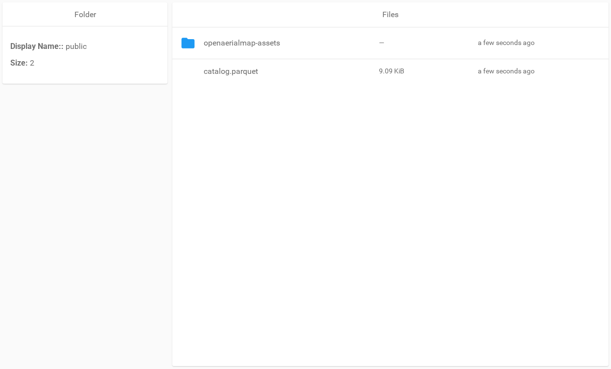

# Share and preview data

Public shares are deployment configuration. Users cannot create or delete
them through the web interface or authenticated API.

## Configure a public share

Set `FB_DEFAULT_SHARES` before packageR starts. Each entry has a public link
name and an object path:

```bash
export FB_DEFAULT_SHARES='my-share=/public;my-report=/reports/report.tif'
./init.sh --serve
```

A directory share lets a public visitor navigate below the configured path. A
file share opens that file. The visitor cannot navigate above the shared path.

The link name must contain 1 to 20 lowercase letters, digits, dots, or
hyphens.



## Protect a share

Map a configured share to a PIN with `FB_DEFAULT_SHARE_PINS`:

```bash
export FB_DEFAULT_SHARE_PINS='my-share=1234'
```

The browser asks for this PIN. API clients send it in the
`X-SHARE-PASSWORD` header. Inject PIN values from a deployment secret and do
not write them to logs.

## Use a direct object URL

For an authenticated file or a public shared file, select **Show** next to
**Presigned URL**. packageR creates a direct S3 GET URL. This avoids routing
the object body through packageR.

The API can also return a `307 Temporary Redirect` to the direct URL. See the
[HTTP API](../reference-guides/http-api.md#resources).

## Preview a COG

Open a TIFF or GeoTIFF object from the file list or public share. The viewer
uses the presigned URL and byte-range requests to load the required image
parts.

If the viewer does not load, ask the operator to check:

- S3 CORS access for the packageR origin;
- `GET`, `HEAD`, and the `Range` request header;
- exposed range and object metadata response headers; and
- support for HTTP `206 Partial Content` through any storage proxy.


## Publish a STAC-compatible Parquet catalog

Place the Parquet catalog inside the directory that you share. Each row must
contain `id` and an `assets` JSON object with `href` values. Rows can also
contain `geometry`, `bbox`, `properties`, and `repository`. The catalog does
not need full STAC GeoParquet compliance.

Set `FB_CATALOG_DEFAULT_NAME` to the catalog's relative path before bootstrap.
The value applies to each configured share. The default is `catalog.parquet`.

For a share named `my-share`, request the full catalog:

```text
/api/public/catalog/my-share
```

Add a path below the share to select matching catalog entries:

```text
/api/public/catalog/my-share/path/to/package
```

The response is a STAC `Feature` or `FeatureCollection`. packageR rewrites
matching asset links to public-share URLs that can redirect to presigned S3
URLs.

See the [HTTP API](../reference-guides/http-api.md#public-catalogs) for the
contract and limits.
