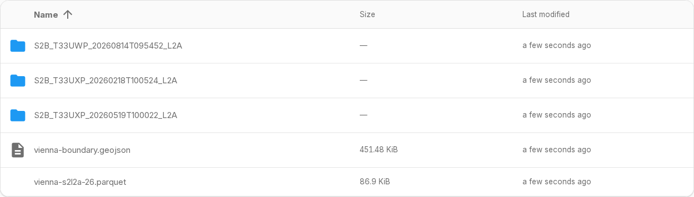
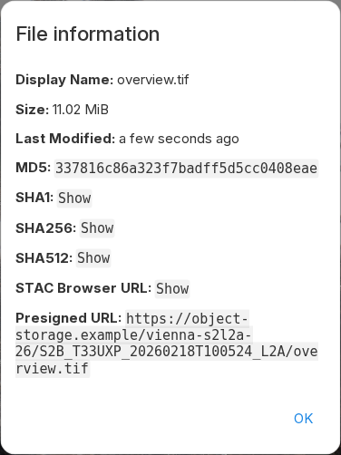
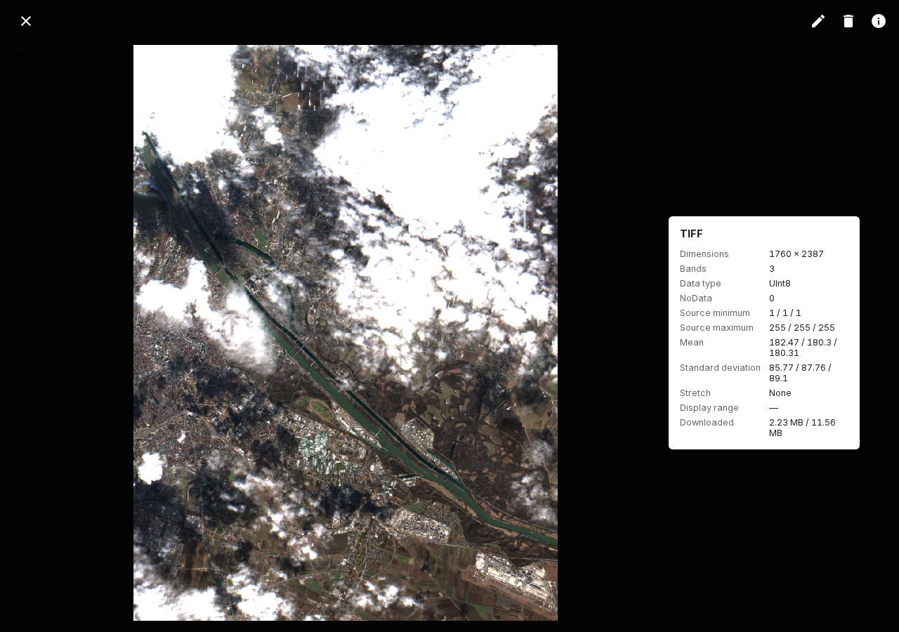
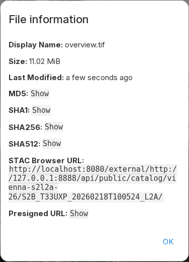
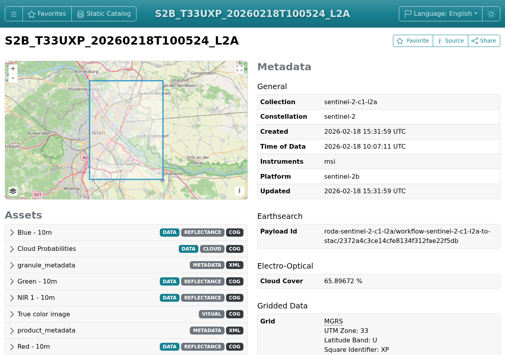

# Package, share, and preview data

packageR publishes an object prefix as a browser package. Recipients do not
need an account. Operators define packages before startup. Users can open the
links in the web interface, but cannot change them.

## Package an object prefix

Use the share command to map a public name to an object path. When
`PACKAGE_R_ROOT` selects one bucket, the path is a prefix in that bucket:

```bash
./package-r shares add admin public /deliverables/26-06 \
  --description="June 2026 deliverables" \
  --expiration=30d
./package-r shares add admin f4ae91c8d2 /reports/report.tif
```

A prefix package lets a public visitor navigate below the configured path. A
single-object package opens that object. The visitor cannot navigate above the
configured path.

The package name is part of its URL. It must contain 1 to 20 lowercase letters,
digits, dots, or hyphens.

Use `--description` to add a short label. Signed-in users see it with the
share link in **Settings**.

Use `--expiration` to set the share lifetime. Use a positive number with days
(`d`), calendar months (`m`), hours (`H`), or calendar years (`y`). For
example, use `10d`, `2m`, `3H`, or `2y`. Leave it empty to create a share
without an expiration.

A hard-to-guess name can reduce accidental discovery, but it is not an access
control. Add a share password when recipients must authenticate before they
open the package.



## Protect a package with a share password

Pass the password when you add the share:

```bash
./package-r shares add admin f4ae91c8d2 /reports/report.tif \
  --password=my-password
```

The browser asks for the password before it opens the package. API clients send
it in `X-SHARE-PASSWORD`. Read passwords from a deployment secret and do not
write them to logs.

## Use a direct object URL

Authenticated files and public shares use the same browser interface. Public
shares are read-only and do not show upload, change, delete, download, or
directory archive actions.

Open a supported file to preview it through a presigned URL. Select **Info**,
then select **Show** next to **Presigned URL** to display the direct S3 GET
URL. The file does not pass through packageR.



The API can also return a `307 Temporary Redirect` to the direct URL. See the
[HTTP API](../reference-guides/http-api.md#public-shares).

## Preview a COG

Open a TIFF or GeoTIFF object from the file list or public share. The viewer
uses the presigned URL and byte-range requests to load the required image
parts.

If the viewer does not load, check:

- S3 CORS access for the packageR origin
- `GET`, `HEAD`, and the `Range` request header
- exposed range and object metadata response headers
- HTTP `206 Partial Content` support in each storage proxy



## Publish a STAC-compatible Parquet catalog

The `vienna-s2l2a-26` example contains three Sentinel-2 Collection 1 Level-2A
scenes from [Earth Search by Element 84](https://earth-search.aws.element84.com/v1/).
The preparation script downloads the source COG ranges for February, May, and
August 2026, clips them to Vienna, builds an RGB COG for each date, and writes
the assets and metadata to one STAC catalog in Parquet format. This catalog also
follows the [STAC GeoParquet specification](https://github.com/radiantearth/stac-geoparquet-spec/blob/main/stac-geoparquet-spec.md).

Place the Parquet catalog inside the shared directory. Each row needs `id`,
STAC time data, and an `assets` JSON object with `href` values. The
[HTTP API](../reference-guides/http-api.md#public-catalogs) lists all supported
fields and limits.

Use relative asset paths when possible. packageR also resolves root-relative,
HTTP(S), and `s3://` paths that identify an object inside the share. External
URLs stay unchanged. See [ADR-002](../architecture/0002-publish-parquet-catalogs-as-stac.md)
for the matching rules.

Set the relative catalog path when you add the share. If an asset URI does not
match the storage path, add an asset mapping to that share:

```bash
./package-r shares add admin vienna-s2l2a-26 /vienna-s2l2a-26 \
  --catalog-name=vienna-s2l2a-26.parquet \
  --asset-mappings='[{"from":"s3://data/","to":"."}]'
```

In this example, `s3://data/item.tif` maps to `item.tif` at the share root.
Keep the trailing slash in `s3://data/` so that the prefix does not also match
similar bucket names. The `to` value must be relative and stay inside the
share. Most catalogs do not need an asset mapping.

If `--catalog-name` is empty or omitted, the share has no catalog endpoint.

For the Vienna share, request the STAC Collection:

```text
/api/public/catalog/vienna-s2l2a-26
```

Add a path below the share to select matching catalog entries:

```text
/api/public/catalog/vienna-s2l2a-26/S2B_T33UXP_20260218T100524_L2A/
```

The root response is a STAC `Collection` that links to each matching Item. A
path below the share returns a STAC `Feature` or `FeatureCollection`. Internal
asset links become public package URLs.

packageR serves this endpoint dynamically. It uses DuckDB to query the Parquet
catalog and renders the matching rows as STAC JSON when a client requests
`/api/public/catalog`.

Use the absolute endpoint URL in a STAC Browser. Set the public browser's
external-catalog URL when you prepare the database:

```bash
./package-r config set \
  --stac-browser-url=http://localhost:8080/external/
```

Also allow the browser origin to read the public catalog endpoint:

```text
PACKAGE_R_CORS_ALLOWED_ORIGINS=http://localhost:8080
```

Serve packageR through HTTPS when you use an HTTPS STAC Browser. Web browsers
block an HTTPS page from reading an HTTP catalog, including a catalog on
`localhost`. For local development, make an existing STAC Browser checkout
available at `~/stac-browser`. This path can be a symbolic link. Install its
dependencies once:

```bash
pnpm --prefix ~/stac-browser install
```

Start it with `pnpm --prefix ~/stac-browser start` and configure packageR with
`http://localhost:8080/external/`. The repository's VS Code compound launch
starts this local checkout together with packageR.

Open the public share and select **Info** to get the Collection preview link.
Open an acquisition directory and select **Info** to get its Item preview link.
For a file, the link appears above the presigned object URL. In each case,
select **Show** next to **STAC Browser URL**.



Open the link to inspect the Item, its Vienna footprint, metadata, and assets in
the configured STAC Browser.



See the [HTTP API](../reference-guides/http-api.md#public-catalogs) for the
response contract and limits.
