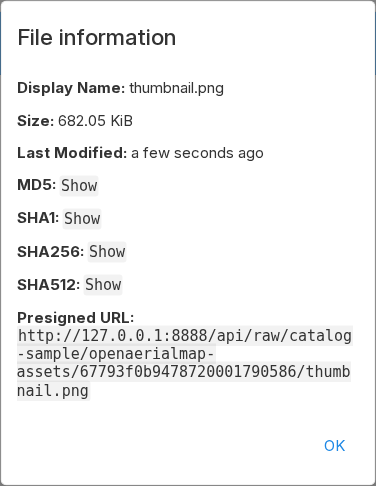

# Work with objects

This guide describes the normal packageR user workflow. The exact buttons that
you see depend on your account permissions.

## Sign in

Your deployment uses one of these sign-in methods:

- Single sign-on through a trusted reverse proxy.
- No sign-in page for a controlled deployment.

With proxy sign-in, the proxy supplies your identity. Do not send the identity
header directly from an untrusted client.

## Browse storage

The first page shows the storage root that the operator configured.

- In service-root mode, the first-level directories are S3 buckets.
- In bucket mode, `/` is the root of one S3 bucket.

Use the directory list or breadcrumb path to navigate. Search applies below the
path that you can access. packageR prevents a user scope from escaping its
configured root.

## Inspect and download an object

Open a file to use its normal viewer. Use **Info** to see its name, size,
modification time, type, checksums, and presigned URL when available.

Choose **Download** to download through packageR. If you need a direct S3 URL,
open **Info** and select **Show** next to **Presigned URL**. The URL is valid
for at most seven days. Treat it as a temporary credential and do not publish
it in logs or source code.

## Upload data

Use **Upload** to select files or folders. You can also drag files into the
file list. The browser uses resumable uploads for large files.

An upload first uses local rclone cache space on the packageR server. The
upload is complete only after rclone writes the object to S3. Contact the
operator if an upload fails because the server cache is full or not writable.

## Manage objects

Select an item to use these actions:

- **Rename** changes its name in the same directory.
- **Copy** creates a copy at the selected destination.
- **Move** moves it to the selected destination.
- **Delete** removes it.
- **New folder** creates a directory marker when the object store needs one.

Object storage does not have normal filesystem rename semantics. A rename or
move can copy data and then delete the source. Large operations can therefore
take time and can add storage request costs.

If an action is not available, your account does not have its permission. If
an allowed action returns `403 Forbidden`, the application scope, an access
rule, or the object-store policy can be more restrictive.

## Supported previews

The built-in viewers support common text, image, audio, and video formats.
packageR also supports TIFF, GeoTIFF, and COG preview. STAC-compatible Parquet
files are used for public catalog queries and do not have a general table
viewer. Zarr does not have a dedicated viewer.

See [Share and preview data](share-and-preview-data.md) to use configured
public shares, direct object URLs, and STAC catalog responses.
