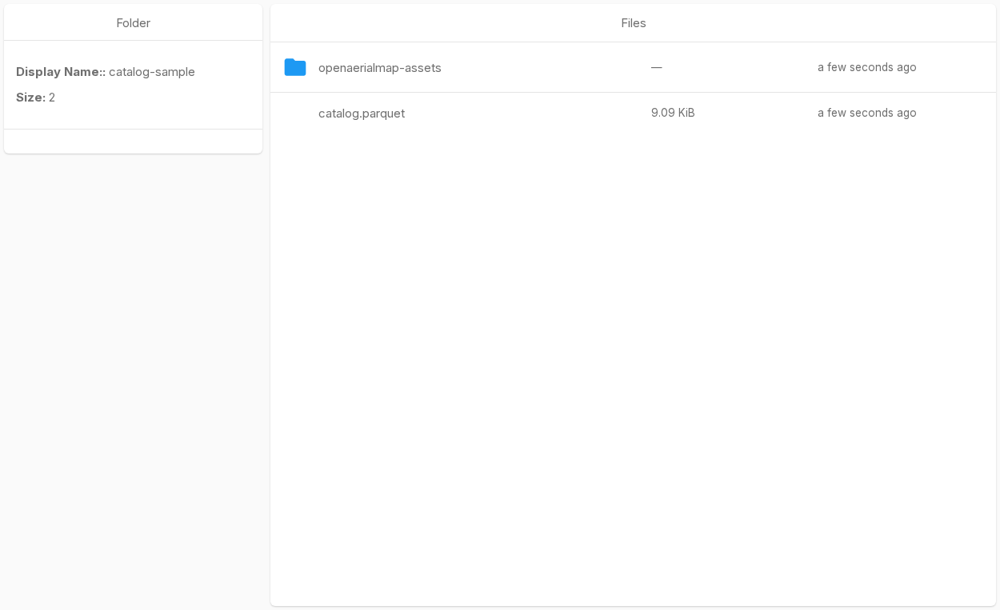

# packageR

packageR packages a prefix of S3-compatible bucket objects for public
distribution. An operator assigns a package name to the prefix. Recipients can
then browse or download the package without an account or login. The package
name can be short and memorable, arbitrary within the supported URL format, or
hard to guess. An optional share password provides access protection. If the
share contains a Parquet catalog that lists its objects, packageR can also
expose it as [SpatioTemporal Asset Catalog
(STAC)](https://stacspec.org/)-compatible JSON.

For example, one configuration can expose `/deliverables/26-06` at a simple
URL such as `/share/public/`. Another can use a hard-to-guess name such as
`/share/f4ae91c8d2/`. A hard-to-guess name reduces accidental discovery, but it
is not authentication. Use a share password when the package needs access
protection.

packageR also provides a web interface for S3-compatible object storage. It
lets users browse object data as a file tree and keeps the familiar File
Browser workflow for files, permissions, and configured public packages.

packageR connects to object storage directly:

```text
Browser -> packageR API -> embedded rclone VFS -> S3-compatible storage
                         -> presigned GET URL
```

Users can:

- access configured object-prefix packages without a login, with an optional
  share password;
- browse one bucket or all buckets that the service credentials can access;
- upload, download, create, rename, copy, move, and delete objects;
- inspect metadata and calculate checksums;
- create direct, time-limited object URLs;
- preview common files and Cloud Optimized GeoTIFFs (COGs); and
- expose a STAC-compatible Parquet catalog as public STAC JSON.

The current design uses one process-owned S3 credential source. It can use a
standard S3 access-key pair or provider-supported workload identity, such as
AWS IRSA. All sessions use that storage identity for file operations and
presigned URLs.

The storage policy associated with the credentials defines maximum access.
packageR can narrow access with identity scopes, path rules, and action
permissions. With `PACKAGE_R_CREATE_USER_DIR=true`, a non-admin user can access their
own directory below `/home` but cannot access a sibling home. The `/home`
directory remains readable for navigation, but users cannot modify it or an
ancestor. Content outside `/home` remains available when the user's scope and
other rules allow it. `PACKAGE_R_ALLOW_CHANGING` controls whether the user can change
allowed paths. Neither setting selects per-user credentials. The current proxy
flow does not derive storage or permission profiles from login claims.

## Choose a guide

- **New users:** [Work with objects](how-to-guides/work-with-objects.md)
- **Package and distribute data:**
  [Package, share, and preview data](how-to-guides/share-and-preview-data.md)
- **Operators:** [Run packageR](how-to-guides/run-package-r.md) and
  [Configuration](how-to-guides/configuration.md)
- **API clients:** [HTTP API](reference-guides/http-api.md)


